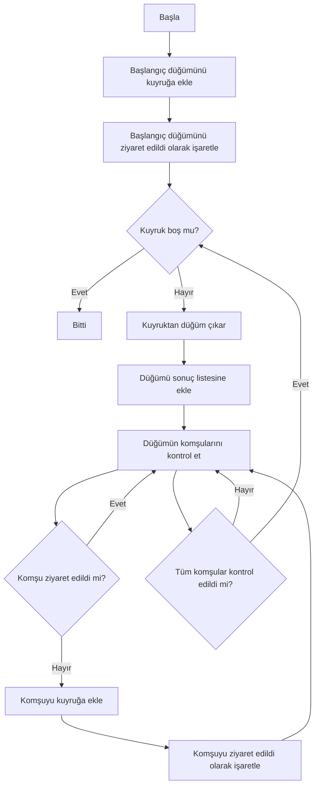
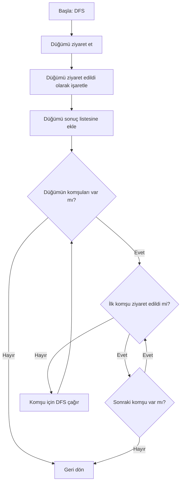
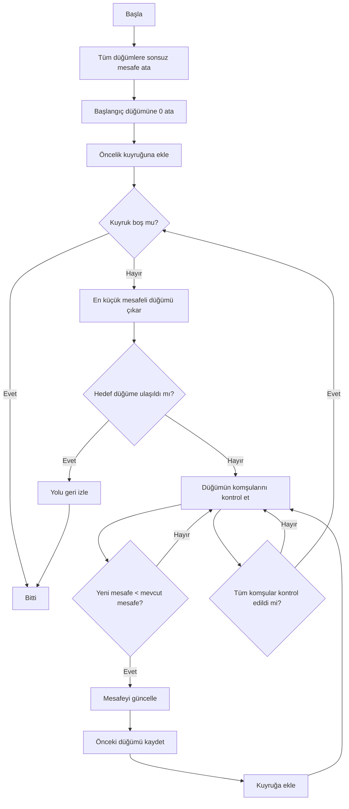
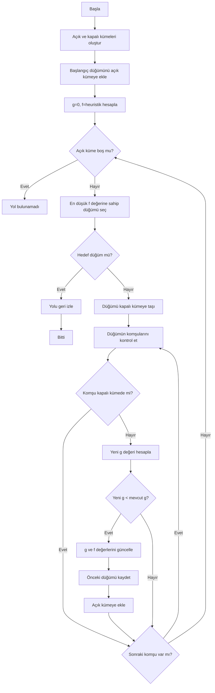
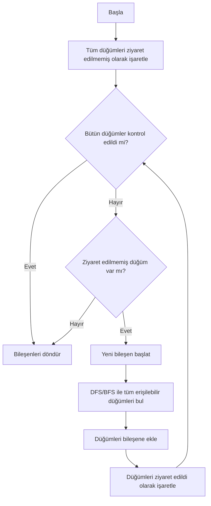
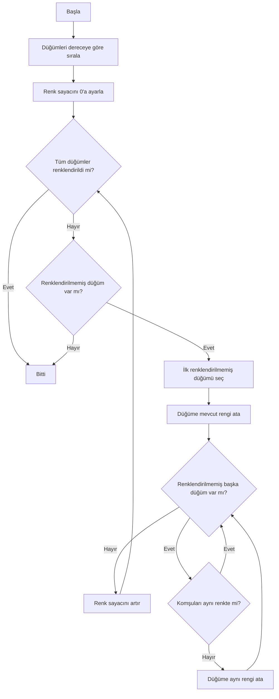
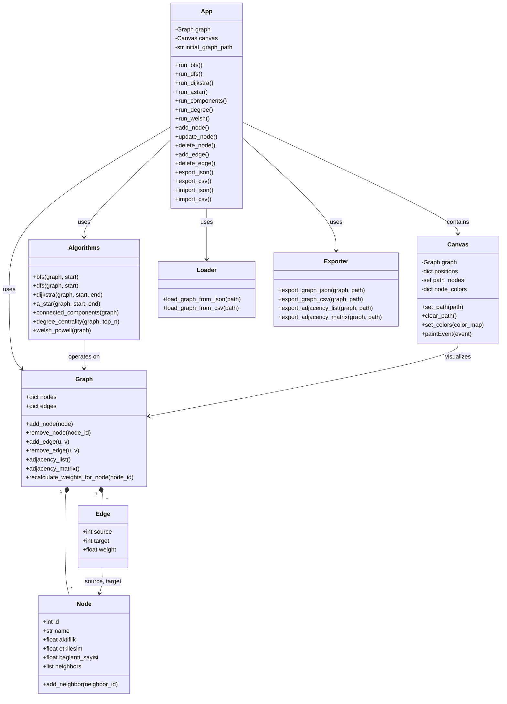

# Sosyal Ağ Analizi Uygulaması

**Proje Adı:** Sosyal Ağ Analizi ve Graf Görselleştirme Uygulaması  
**Ekip Üyeleri:** [İsim 1], [İsim 2]  
**Tarih:** Ocak 2026  
**Ders:** Yazılım Geliştirme Laboratuvarı-I

---

## 1. Giriş

### 1.1. Problemin Tanımı

Sosyal ağlarda kullanıcılar arasındaki ilişkileri analiz etmek, en kısa yolları bulmak, toplulukları tespit etmek ve etkili kullanıcıları belirlemek için kapsamlı bir graf analiz uygulaması geliştirilmiştir. Bu uygulama, graf veri yapıları ve çeşitli algoritmalar kullanarak sosyal ağ üzerindeki bağlantıları görselleştirir ve analiz eder.

### 1.2. Amaç

Projenin temel amaçları şunlardır:

- Graf yapılarını nesne yönelimli programlama prensipleriyle modellemek
- BFS, DFS, Dijkstra, A* gibi temel graf algoritmalarını uygulamak
- Bağlı bileşenleri ve toplulukları tespit etmek
- Derece merkeziliği ile en etkili kullanıcıları belirlemek
- Welsh-Powell algoritması ile graf renklendirme yapmak
- Dinamik ağırlık hesaplaması ile gerçekçi maliyet analizi yapmak
- Kullanıcı dostu bir arayüz ile görselleştirme sağlamak
- JSON ve CSV formatlarında veri içe/dışa aktarımı yapmak

### 1.3. Kapsam

Uygulama, küçük (10-20 düğüm) ve orta ölçekli (50-100 düğüm) graflar üzerinde çalışacak şekilde tasarlanmıştır. Tüm algoritmalar makul sürelerde (birkaç saniye) çalışmaktadır.

---

## 2. Algoritmalar

### 2.1. BFS (Breadth-First Search - Genişlik Öncelikli Arama)

#### 2.1.1. Çalışma Mantığı

BFS, bir düğümden başlayarak tüm komşu düğümleri önce ziyaret eden, sonra bu komşuların komşularını ziyaret eden bir graf gezinti algoritmasıdır. Kuyruk (queue) veri yapısı kullanılır.

**Algoritma Adımları:**
1. Başlangıç düğümünü kuyruğa ekle ve ziyaret edildi olarak işaretle
2. Kuyruk boş olana kadar:
   - Kuyruktan bir düğüm çıkar
   - Bu düğümün tüm ziyaret edilmemiş komşularını kuyruğa ekle
   - Komşuları ziyaret edildi olarak işaretle
3. Tüm erişilebilir düğümler ziyaret edildiğinde dur

#### 2.1.2. Akış Diyagramı



#### 2.1.3. Karmaşıklık Analizi

- **Zaman Karmaşıklığı:** O(V + E)  
  - V: Düğüm sayısı, E: Kenar sayısı
  - Her düğüm ve kenar bir kez işlenir

- **Uzay Karmaşıklığı:** O(V)  
  - Kuyruk ve ziyaret edilen düğümler listesi için

#### 2.1.4. Literatür İncelemesi

BFS algoritması, 1950'lerde graf teorisinde geliştirilmiştir. En kısa yol problemlerinde (ağırlıksız graflarda) ve seviye bazlı gezintilerde yaygın olarak kullanılır. Cormen et al. (2009) "Introduction to Algorithms" kitabında detaylı olarak açıklanmıştır.

---

### 2.2. DFS (Depth-First Search - Derinlik Öncelikli Arama)

#### 2.2.1. Çalışma Mantığı

DFS, bir düğümden başlayarak mümkün olduğunca derine inen, geri dönüş (backtracking) yaparak tüm düğümleri ziyaret eden bir algoritmadır. Yığın (stack) veya özyineleme kullanılır.

**Algoritma Adımları:**
1. Başlangıç düğümünü ziyaret et ve ziyaret edildi olarak işaretle
2. Bu düğümün ziyaret edilmemiş komşuları için özyinelemeli olarak DFS çağır
3. Tüm komşular ziyaret edildiğinde geri dön

#### 2.2.2. Akış Diyagramı



#### 2.2.3. Karmaşıklık Analizi

- **Zaman Karmaşıklığı:** O(V + E)
- **Uzay Karmaşıklığı:** O(V) (özyineleme yığını için)

#### 2.2.4. Literatür İncelemesi

DFS, graf teorisinde temel bir algoritmadır. Topolojik sıralama, bağlı bileşen tespiti ve döngü bulma gibi problemlerde kullanılır.

---

### 2.3. Dijkstra En Kısa Yol Algoritması

#### 2.3.1. Çalışma Mantığı

Dijkstra algoritması, ağırlıklı graflarda bir başlangıç düğümünden diğer tüm düğümlere olan en kısa yolları bulur. Öncelik kuyruğu (priority queue) kullanılır.

**Algoritma Adımları:**
1. Tüm düğümlere sonsuz mesafe ata, başlangıç düğümüne 0 ata
2. Öncelik kuyruğuna (mesafe, düğüm) ekle
3. Kuyruk boş olana kadar:
   - En küçük mesafeli düğümü çıkar
   - Bu düğümün komşuları için mesafeleri güncelle
   - Daha kısa yol bulunursa güncelle ve kuyruğa ekle
4. Hedef düğüme ulaşıldığında veya tüm düğümler işlendiğinde dur

#### 2.3.2. Akış Diyagramı



#### 2.3.3. Karmaşıklık Analizi

- **Zaman Karmaşıklığı:** O((V + E) log V)  
  - Öncelik kuyruğu işlemleri için log V
  - Her düğüm ve kenar bir kez işlenir

- **Uzay Karmaşıklığı:** O(V)  
  - Mesafe ve önceki düğüm dizileri için

#### 2.3.4. Literatür İncelemesi

Dijkstra algoritması, 1956 yılında Edsger W. Dijkstra tarafından geliştirilmiştir. Ağırlıklı graflarda en kısa yol problemlerinin çözümünde standart algoritmadır.

---

### 2.4. A* (A-Star) En Kısa Yol Algoritması

#### 2.4.1. Çalışma Mantığı

A* algoritması, Dijkstra'nın geliştirilmiş halidir. Heuristik fonksiyon kullanarak hedefe daha hızlı yakınsar. f(n) = g(n) + h(n) formülü kullanılır:
- g(n): Başlangıçtan n'ye olan gerçek maliyet
- h(n): n'den hedefe olan tahmini maliyet (heuristik)

**Algoritma Adımları:**
1. Açık küme (open set) ve kapalı küme (closed set) oluştur
2. Başlangıç düğümünü açık kümeye ekle, g=0, f=heuristik
3. Açık küme boş olana kadar:
   - En düşük f değerine sahip düğümü seç
   - Hedef düğümse yolu geri izle
   - Düğümü kapalı kümeye taşı
   - Komşuları kontrol et ve güncelle
4. Yol bulunamazsa hata döndür

#### 2.4.2. Akış Diyagramı



#### 2.4.3. Karmaşıklık Analizi

- **Zaman Karmaşıklığı:** O(b^d)  
  - b: dallanma faktörü, d: derinlik
  - İyi heuristik ile O(E log V) seviyesine inebilir

- **Uzay Karmaşıklığı:** O(V)  
  - Açık ve kapalı kümeler için

#### 2.4.4. Literatür İncelemesi

A* algoritması, 1968 yılında Peter Hart, Nils Nilsson ve Bertram Raphael tarafından geliştirilmiştir. Oyun programlama, robotik ve yol bulma problemlerinde yaygın olarak kullanılır.

---

### 2.5. Bağlı Bileşenler Tespiti

#### 2.5.1. Çalışma Mantığı

Bir grafın bağlı bileşenleri, birbirine yol ile bağlı düğüm gruplarıdır. DFS veya BFS kullanılarak tespit edilir.

**Algoritma Adımları:**
1. Tüm düğümleri ziyaret edilmemiş olarak işaretle
2. Her ziyaret edilmemiş düğüm için:
   - DFS/BFS başlat
   - Erişilebilen tüm düğümleri bir bileşene ekle
3. Tüm düğümler işlendiğinde bileşenleri döndür

#### 2.5.2. Akış Diyagramı



#### 2.5.3. Karmaşıklık Analizi

- **Zaman Karmaşıklığı:** O(V + E)
- **Uzay Karmaşıklığı:** O(V)

---

### 2.6. Derece Merkeziliği (Degree Centrality)

#### 2.6.1. Çalışma Mantığı

Derece merkeziliği, bir düğümün sahip olduğu bağlantı sayısını ölçer. Yüksek dereceli düğümler, ağda daha merkezi ve etkilidir.

**Algoritma Adımları:**
1. Her düğüm için komşu sayısını (derece) hesapla
2. Derecelere göre azalan sırada sırala
3. En yüksek N düğümü döndür

#### 2.6.2. Karmaşıklık Analizi

- **Zaman Karmaşıklığı:** O(V log V) (sıralama için)
- **Uzay Karmaşıklığı:** O(V)

---

### 2.7. Welsh-Powell Graf Renklendirme

#### 2.7.1. Çalışma Mantığı

Welsh-Powell algoritması, komşu düğümlerin farklı renklere sahip olması gereken minimum renk sayısını bulur.

**Algoritma Adımları:**
1. Düğümleri derecelerine göre azalan sırada sırala
2. Her düğüm için:
   - Komşularında kullanılmayan ilk rengi ata
   - Aynı renge atanabilecek diğer düğümleri bul ve ata
3. Tüm düğümler renklendirildiğinde dur

#### 2.7.2. Akış Diyagramı



#### 2.7.3. Karmaşıklık Analizi

- **Zaman Karmaşıklığı:** O(V² + E)  
  - Sıralama: O(V log V)
  - Renklendirme: O(V²) (en kötü durum)

- **Uzay Karmaşıklığı:** O(V)

#### 2.7.4. Literatür İncelemesi

Welsh-Powell algoritması, 1967 yılında D.J.A. Welsh ve M.B. Powell tarafından geliştirilmiştir. Graf renklendirme problemlerinde yaklaşık çözüm sağlar.

---

## 3. Proje Yapısı ve Sınıf Diyagramı

### 3.1. Modül Yapısı

```
yazlab22/
├── src/
│   ├── core/           # Çekirdek graf yapıları
│   │   ├── node.py     # Node sınıfı
│   │   ├── edge.py     # Edge sınıfı
│   │   ├── graph.py    # Graph sınıfı
│   │   ├── weight.py   # Ağırlık hesaplama
│   │   └── algorithms.py # Algoritma sınıfları
│   ├── ui/             # Kullanıcı arayüzü
│   │   ├── app.py      # Ana uygulama penceresi
│   │   └── canvas.py   # Graf görselleştirme
│   ├── io_/            # Veri giriş/çıkış
│   │   ├── loader.py   # JSON/CSV yükleme
│   │   └── exporter.py # JSON/CSV dışa aktarma
│   ├── data/           # Veri dosyaları
│   │   └── graph.json  # Başlangıç grafı
│   └── main.py         # Program giriş noktası
└── README.md           # Proje raporu
```

### 3.2. Sınıf Diyagramı



### 3.3. Sınıf Açıklamaları

#### 3.3.1. Node
Graf düğümlerini temsil eder. Her düğüm, id, isim, aktiflik, etkileşim ve bağlantı sayısı özelliklerine sahiptir. Komşu düğümlerin id'lerini tutar.

#### 3.3.2. Edge
Graf kenarlarını temsil eder. Kaynak ve hedef düğümleri ile ağırlık değerini içerir.

#### 3.3.3. Graph
Graf veri yapısını yönetir. Düğüm ve kenar ekleme/silme işlemlerini gerçekleştirir. Komşuluk listesi ve matrisi üretir.

#### 3.3.4. Algorithms
Tüm graf algoritmalarını içeren statik metodlar sınıfıdır. BFS, DFS, Dijkstra, A*, bağlı bileşenler, derece merkeziliği ve Welsh-Powell algoritmalarını içerir.

#### 3.3.5. App
PyQt5 tabanlı ana uygulama penceresidir. Kullanıcı arayüzü bileşenlerini yönetir ve algoritmaları tetikler.

#### 3.3.6. Canvas
Grafın görselleştirilmesini sağlar. Düğümleri ve kenarları çizer, yol ve renklendirme vurgularını gösterir.

#### 3.3.7. Loader
JSON ve CSV formatlarından graf verilerini yükler.

#### 3.3.8. Exporter
Graf verilerini JSON, CSV ve komşuluk listesi/matrisi formatlarında dışa aktarır.

---

## 4. Uygulama Açıklamaları

### 4.1. Kullanıcı Arayüzü

Uygulama, sol tarafta graf görselleştirme alanı (Canvas), sağ tarafta kontrol paneli ve alt kısımda sonuç gösterim alanından oluşur.

#### 4.1.1. Ana Ekran Özellikleri

- **Graf Görselleştirme:** Düğümler daire, kenarlar çizgi olarak gösterilir
- **Ağırlık Gösterimi:** Kenarların üzerinde ağırlık değerleri görüntülenir
- **Etkileşimli Düğümler:** Düğümlere tıklanarak detay bilgileri görüntülenir
- **Renklendirme:** Algoritma sonuçlarına göre düğümler renklendirilir

#### 4.1.2. Kontrol Paneli

**Algoritma Bölümü:**
- Başlangıç ve bitiş düğüm ID'leri girilir
- BFS, DFS, Dijkstra, A*, Bağlı Bileşenler, Derece Merkeziliği, Welsh-Powell butonları

**Düğüm İşlemleri:**
- Düğüm ekleme, güncelleme, silme
- Aktiflik, etkileşim, bağlantı sayısı özellikleri

**Kenar İşlemleri:**
- Kenar ekleme ve silme

**Veri İşlemleri:**
- JSON/CSV dışa aktarma
- JSON/CSV içe aktarma
- Komşuluk listesi/matrisi dışa aktarma
- Başlangıç grafına dönme

### 4.2. Dinamik Ağırlık Hesaplama

İki düğüm arasındaki ağırlık, aşağıdaki formül ile hesaplanır:

$$
\text{Ağırlık}_{i,j} = \frac{1}{1 + \sqrt{(Aktiflik_i - Aktiflik_j)^2 + (Etkileşim_i - Etkileşim_j)^2 + (Bağlantı_i - Bağlantı_j)^2}}
$$

Bu formül, benzer özelliklere sahip düğümler arasında yüksek ağırlık, farklı özelliklere sahip düğümler arasında düşük ağırlık üretir.

### 4.3. Ekran Görüntüleri

> **Not:** Bu bölüme uygulama ekran görüntüleri eklenecektir.

#### 4.3.1. Ana Ekran
- [Ekran görüntüsü 1: Ana ekran görünümü]

#### 4.3.2. Algoritma Sonuçları
- [Ekran görüntüsü 2: BFS sonuçları]
- [Ekran görüntüsü 3: Dijkstra en kısa yol]
- [Ekran görüntüsü 4: Welsh-Powell renklendirme]
- [Ekran görüntüsü 5: Derece merkeziliği tablosu]

---

## 5. Test Senaryoları ve Sonuçlar

### 5.1. Test Ortamı

- **İşletim Sistemi:** Windows 10/11
- **Python Sürümü:** 3.13
- **Kütüphaneler:** PyQt5, NetworkX (opsiyonel)

### 5.2. Test Senaryoları

#### 5.2.1. Küçük Ölçekli Graf (10-20 Düğüm)

**Test Grafı:** 20 düğüm, 33 kenar

| Algoritma | Düğüm Sayısı | Kenar Sayısı | Çalışma Süresi (ms) | Sonuç |
|-----------|--------------|--------------|---------------------|-------|
| BFS | 20 | 33 | [Değer] | [Sonuç] |
| DFS | 20 | 33 | [Değer] | [Sonuç] |
| Dijkstra | 20 | 33 | [Değer] | [Sonuç] |
| A* | 20 | 33 | [Değer] | [Sonuç] |
| Bağlı Bileşenler | 20 | 33 | [Değer] | [Sonuç] |
| Derece Merkeziliği | 20 | 33 | [Değer] | [Sonuç] |
| Welsh-Powell | 20 | 33 | [Değer] | [Sonuç] |

#### 5.2.2. Orta Ölçekli Graf (50-100 Düğüm)

**Test Grafı:** [Düğüm sayısı], [Kenar sayısı]

| Algoritma | Düğüm Sayısı | Kenar Sayısı | Çalışma Süresi (ms) | Sonuç |
|-----------|--------------|--------------|---------------------|-------|
| BFS | [Değer] | [Değer] | [Değer] | [Sonuç] |
| DFS | [Değer] | [Değer] | [Değer] | [Sonuç] |
| Dijkstra | [Değer] | [Değer] | [Değer] | [Sonuç] |
| A* | [Değer] | [Değer] | [Değer] | [Sonuç] |
| Bağlı Bileşenler | [Değer] | [Değer] | [Değer] | [Sonuç] |
| Derece Merkeziliği | [Değer] | [Değer] | [Değer] | [Sonuç] |
| Welsh-Powell | [Değer] | [Değer] | [Değer] | [Sonuç] |

### 5.3. Hata Yönetimi Testleri

| Test Senaryosu | Beklenen Davranış | Sonuç |
|----------------|-------------------|-------|
| Aynı ID'li düğüm ekleme | Hata mesajı | ✅ |
| Self-loop kenar ekleme | Hata mesajı | ✅ |
| Mevcut kenarı tekrar ekleme | Hata mesajı | ✅ |
| Olmayan düğüm ID'si ile işlem | Hata mesajı | ✅ |
| Geçersiz dosya formatı | Hata mesajı | ✅ |

---

## 6. Sonuç ve Tartışma

### 6.1. Başarılar

- ✅ Tüm istenen algoritmalar başarıyla gerçekleştirildi
- ✅ Nesne yönelimli tasarım prensipleri uygulandı
- ✅ Kullanıcı dostu ve etkileşimli arayüz geliştirildi
- ✅ JSON ve CSV formatlarında veri içe/dışa aktarımı sağlandı
- ✅ Dinamik ağırlık hesaplaması başarıyla uygulandı
- ✅ Küçük ve orta ölçekli graflarda makul performans elde edildi

### 6.2. Sınırlılıklar

- ⚠️ Çok büyük graflarda (1000+ düğüm) performans düşebilir
- ⚠️ Graf yerleşimi otomatik; kullanıcı düğümleri manuel taşıyamaz
- ⚠️ Animasyonlu algoritma gösterimi yok
- ⚠️ Çoklu graf yönetimi desteklenmiyor

### 6.3. Olası Geliştirmeler

- 🔄 Büyük graflar için optimizasyon (Force-directed layout)
- 🔄 Kullanıcı düğümleri sürükle-bırak ile taşıyabilme
- 🔄 Algoritma animasyonları
- 🔄 Çoklu graf yönetimi
- 🔄 Farklı merkezilik metrikleri (betweenness, closeness)
- 🔄 Topluluk tespiti algoritmaları (Louvain, Girvan-Newman)
- 🔄 İstatistiksel analiz ve raporlama

---

## 7. Kaynaklar

1. Cormen, T. H., Leiserson, C. E., Rivest, R. L., & Stein, C. (2009). *Introduction to Algorithms* (3rd ed.). MIT Press.

2. Dijkstra, E. W. (1959). A note on two problems in connexion with graphs. *Numerische Mathematik*, 1(1), 269-271.

3. Hart, P. E., Nilsson, N. J., & Raphael, B. (1968). A formal basis for the heuristic determination of minimum cost paths. *IEEE Transactions on Systems Science and Cybernetics*, 4(2), 100-107.

4. Welsh, D. J. A., & Powell, M. B. (1967). An upper bound for the chromatic number of a graph and its application to timetabling problems. *The Computer Journal*, 10(1), 85-86.

5. PyQt5 Documentation: https://www.riverbankcomputing.com/static/Docs/PyQt5/

---

## 8. Ekler

### 8.1. Kurulum Talimatları

```bash
# Sanal ortam oluştur
python -m venv venv

# Sanal ortamı aktifleştir (Windows)
venv\Scripts\activate

# Bağımlılıkları yükle
pip install -r requirements.txt

# Uygulamayı çalıştır
python src/main.py
```

### 8.2. Gereksinimler

```
PyQt5>=5.15.0
```

---

**Proje Tamamlanma Tarihi:** Ocak 2026  
**Versiyon:** 1.0
